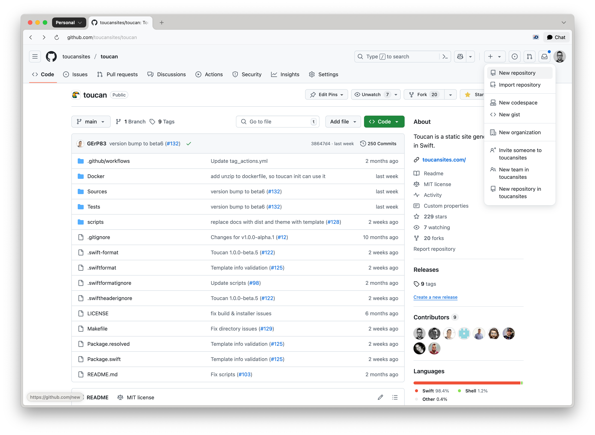
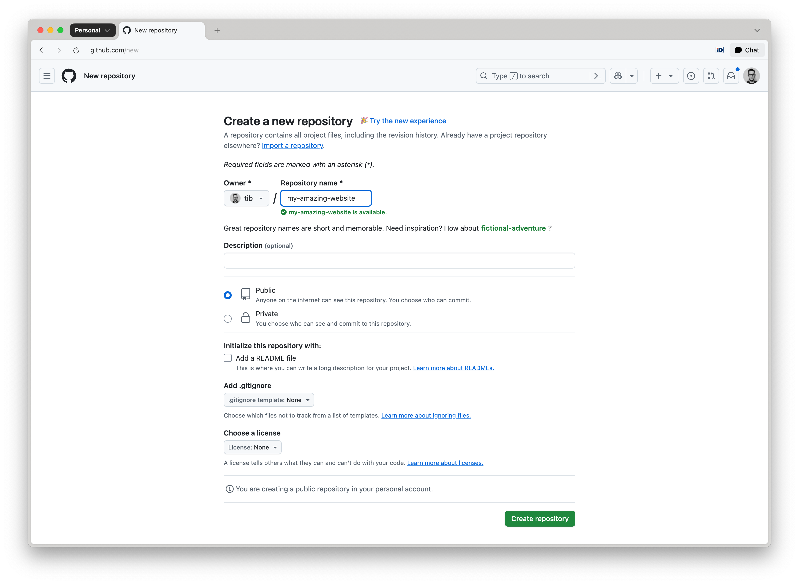
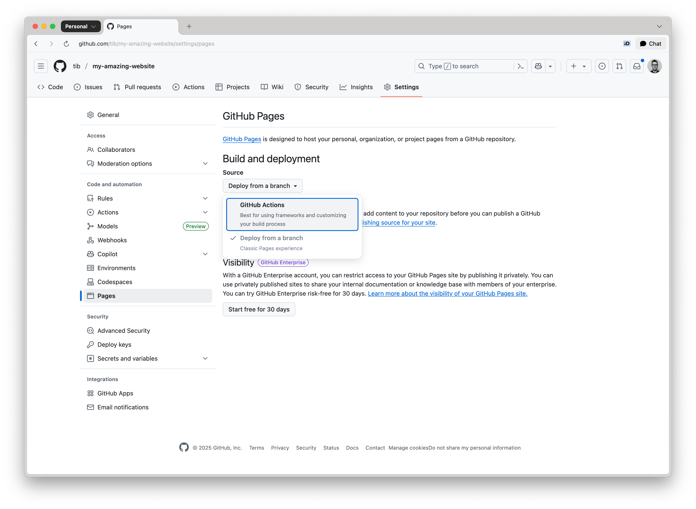
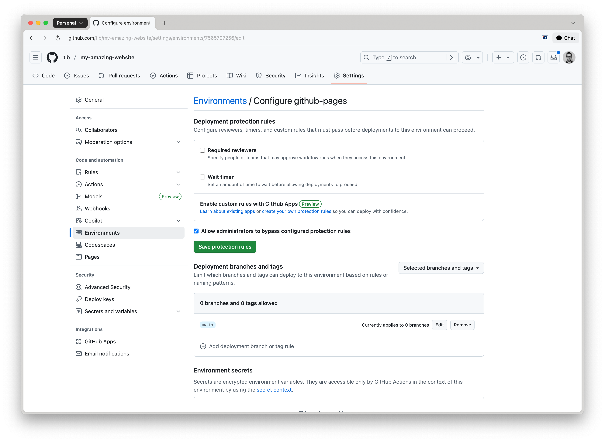
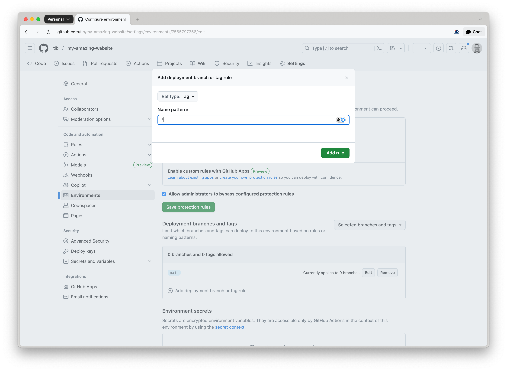
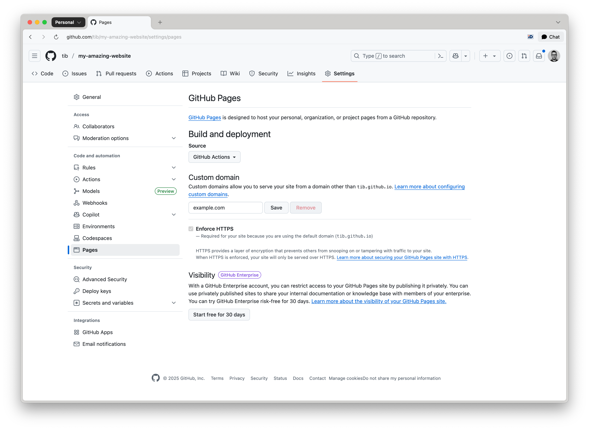

# GitHub Pages

Toucan-based websites can be hosted for free using GitHub Pages. Follow these steps to set up your site.


## Creating a Repository

To host a Toucan-generated website on GitHub Pages, begin by creating a new repository or selecting an existing one. If you are working within an existing repository, proceed directly to the [Deploying with GitHub Pages](/docs/deployment/github-pages/#deploy-using-github-actions) guide.

Navigate to the upper-right corner of any GitHub page. Click the `+` icon, then select **New repository**:




> note: The GitHub Pages URL of your website is going to be (without using a custom domain): `https://owner.github.io/repository-name/`.

From the **Owner** dropdown, select the user or organization account that will own the repository. Enter a custom name for the repository:




Set the repository visibility to **Public**. Refer to [About repositories](https://docs.github.com/en/repositories/creating-and-managing-repositories/about-repositories#about-repository-visibility) for details.

> note: GitHub requires public visibility for Pages sites hosted under Free or Free for Organizations plans.

Click **Create repository** to complete setup.


## Adding Content to Your Repository

Once your repository is set up, commit the necessary files. 

Clone the repository to your local machine:

```bash
git clone https://github.com/owner/repository-name.git
```

Copy your website’s source files into the repository, or use the repository to create a new site directly. 

Add, commit and push the source files to the repository, use the main branch:

```bash
git add .
git commit -m "Add site source"
git push origin main
```

After you've pushed the content files and folders should appear on the GitHub repository. Now you are ready to deploy your website using GitHub Actions.


## Deploy using GitHub Actions 


After pushing your content to GitHub, configure GitHub Pages to publish your website using one of the supported deployment methods.

Navigate to your repository on GitHub. In the top menu, go to **Settings** → **Pages** under the **Build and deployment** section.

Choose how you want GitHub Pages to deploy your site, select the **GitHub Actions** option:




Verify that `.github/workflows/deploy.yml` exists in the repository. If your repository does not include the `deploy.yml` file, you can find an example at:  [toucansites/github-workflows](https://github.com/toucansites/github-workflows):

```yml
name: Build and Deploy with Toucan

on:
  push:
    tags:
        - 'v*'
        - '[0-9]*'
    branches:
        - main

jobs:
  build-with-toucan:
    uses: toucansites/github-workflows/.github/workflows/deploy.yml@main
    permissions:
      contents: read
      pages: write
      id-token: write
    with:
      #version: "1.0.0-beta.6"
      target: "github-deploy"
```

Add, commit and push this file to your to your repository.

When deploying with GitHub Actions, the workflow will automatically select either:

- the `default` target defined in your toucan.yml file, or
- the explicit target specified in the `GitHub Actions workflow` trigger.

Ensure that your `toucan.yml` is correctly configured and that the appropriate target is used when initiating a deployment:

```bash
targets:
    - name: dev
      default: true
    
    - name: "github-deploy"
      output: "/tmp/output"
      url: "https://owner.github.io/repository-name/"
```


By default the GitHub pages has a protection rule, that only allows deployments from the main branch. If you are planning to deploy after you publish a release or tag the repository, you have to change this protection rule.

Navigate to the repository **Settings** click on the **Environments** menu item:



Click on **github-pages**, under the **Deployment branches and tags** section, select **Add deployment branch or tag rule** and set the **Ref type** to `Tag`:



Enter a name pattern such as:
 - `*` — to allow all tags
 - `*/*` — to support namespaced tags like `release/v1.0.0`  
 - `v*-b*` - to support beta releases, like `v1.0.0-beta.1`

Click **Add rule** to confirm the configuration.

> warn: If the environment is not properly configured, deployments will be blocked with an error such as: Tag `1.0.0-beta.2` is not allowed to deploy to github-pages due to environment protection rules.

To trigger the GitHub Actions deployment workflow, create a new release or add a tag to your repository.

## Using a Custom Domain

You can configure your GitHub Pages site to be served from a [custom domain](https://docs.github.com/en/pages/configuring-a-custom-domain-for-your-github-pages-site/managing-a-custom-domain-for-your-github-pages-site), such as `example.com`, instead of the default GitHub URL.

Navigate to your repository on GitHub. Go to **Settings** → **Pages**.

Under the **Custom domain** section, enter your domain name and click **Save**:




Make sure a `CNAME` file is in the deployed directory (usually `dist/`) when you deploy your site. To do this, create a `CNAME` file in the top-level `assets` directory with the following content:

```text
example.com
```

Toucan will automatically move this `CNAME` file to the `dist` folder when your site is generated.


### DNS Configuration

For Apex Domains (`example.com`), create the following **A records** in your DNS provider’s configuration:

```bash
185.199.108.153
185.199.109.153
185.199.110.153
185.199.111.153
```

For Subdomains (`www.example.com`), create a **CNAME** record pointing to your GitHub Pages URL:

```bash
owner.github.io
```

Replace `owner` with your actual GitHub repository owner name.


### Enforce HTTPS

After DNS propagation is complete (which can take anywhere from a few minutes to 24 hours):

- Return to **Settings → Pages** in your GitHub repository.
- Enable the **Enforce HTTPS** checkbox to ensure secure access to your site.

