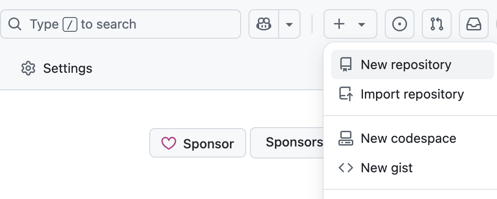
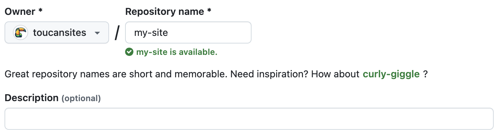

# Creating a Repository for Your Site

You can either create a new repository or use an existing one.

If not all files in your repository are part of the site, you can configure GitHub Pages to publish from a specific folder or use a GitHub Actions workflow for deployment.

> For accounts using GitHub Free, the repository must be public.

## Steps

1. In the upper-right corner of any GitHub page, click `+` → **New repository**.
   

2. Choose the **Owner** (user or organization).
   

3. Set the name:
   - For user/org-wide sites, it must be `username.github.io` or `orgname.github.io`
   - All lowercase
   

4. Choose **Public** visibility. For more information, see [About repositories](https://docs.github.com/en/repositories/creating-and-managing-repositories/about-repositories#about-repository-visibility).
5. Enable **Initialize with a README**.
6. Click **Create repository**.

If you're using an existing repo, skip to the [Deploying with GitHub Pages](/docs/github-pages/deploying-with-gh) guide.
