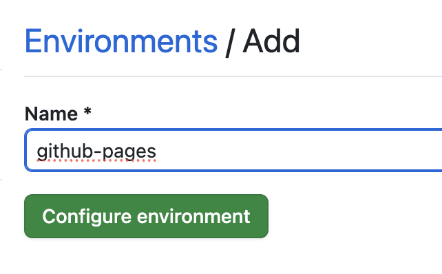
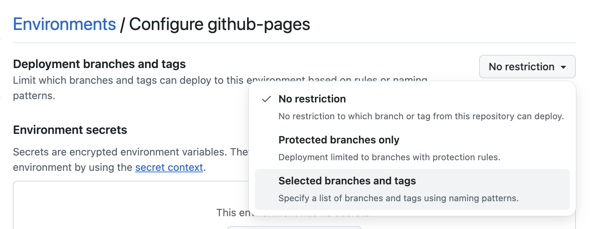
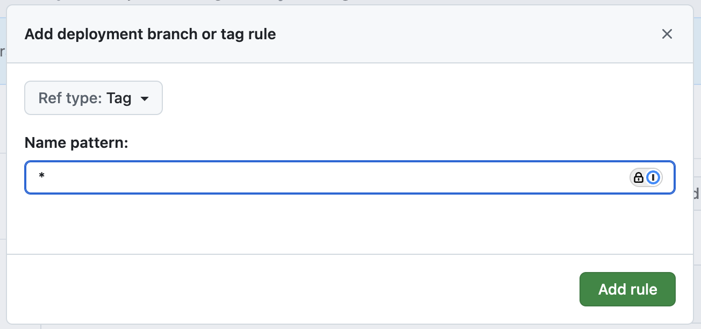

# Configuring GitHub Pages Environment

If your GitHub Actions workflow deploys on a tag or branch trigger and targets an environment named `github-pages`, you must explicitly configure that environment in your repository settings.

Failing to configure the environment correctly will result in GitHub blocking the deployment due to protection rules.

## Setup Steps

1. Open your GitHub repository. Navigate to **Settings** → **Environments** under the **Code and automation** section.

2. Click **New environment** and set the name exactly as:

   ```text
   github-pages
   ```

   

3. In the newly created environment:

   - Under **Deployment branches and tags**, click the dropdown and select **Selected branches and tags**.
     

   - Click **Add deployment branch or tag rule**.
   - Set the **Ref type** to `Tag` or `Branch`.
   - Enter a name pattern such as:
     - `*` — to allow all tags
     - `*/*` — to support namespaced tags like `release/v1.0.0`  
     You may include both if needed.
     

4. Click **Add rule** to confirm the configuration.

## Example Trigger Patterns

If your workflow uses tags or branches, your trigger might look like:

```yaml
on:
push:
 tags:
   - 'v*'      # example: v1.0.0
 branches:
   - main      # example: main branch
```

> If your repository does not include the `deploy.yml` file, you can find an example at:  
> [toucansites/github-workflows](https://github.com/toucansites/github-workflows)

## Important

If the environment is not properly configured, deployments will be blocked with an error such as:

> Tag `1.0.0-beta.2` is not allowed to deploy to github-pages due to environment protection rules.
