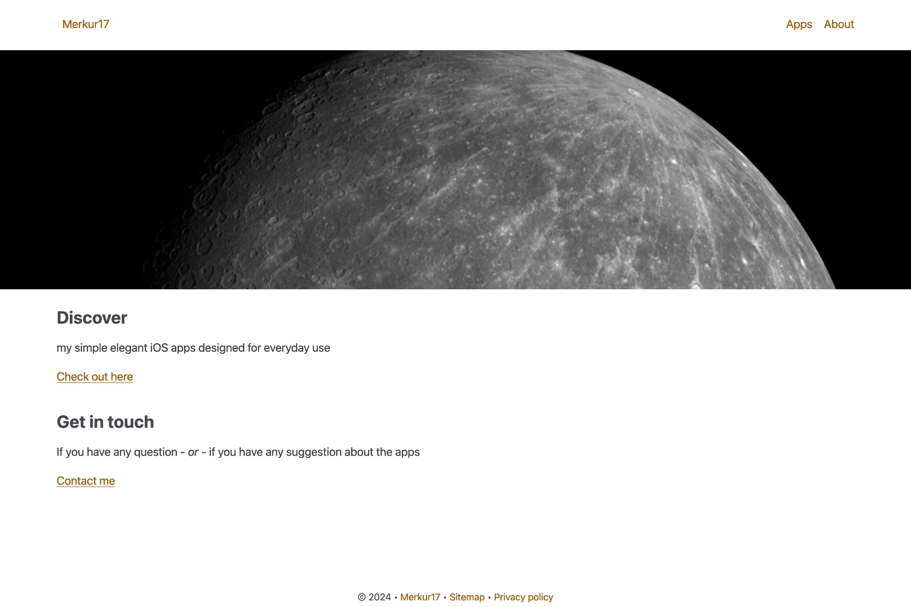
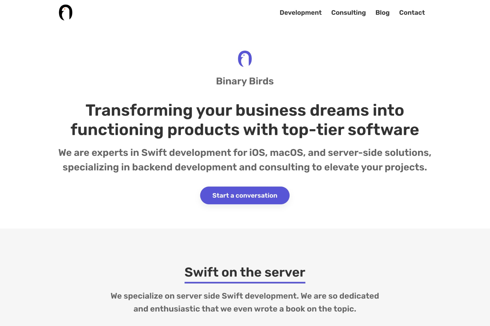
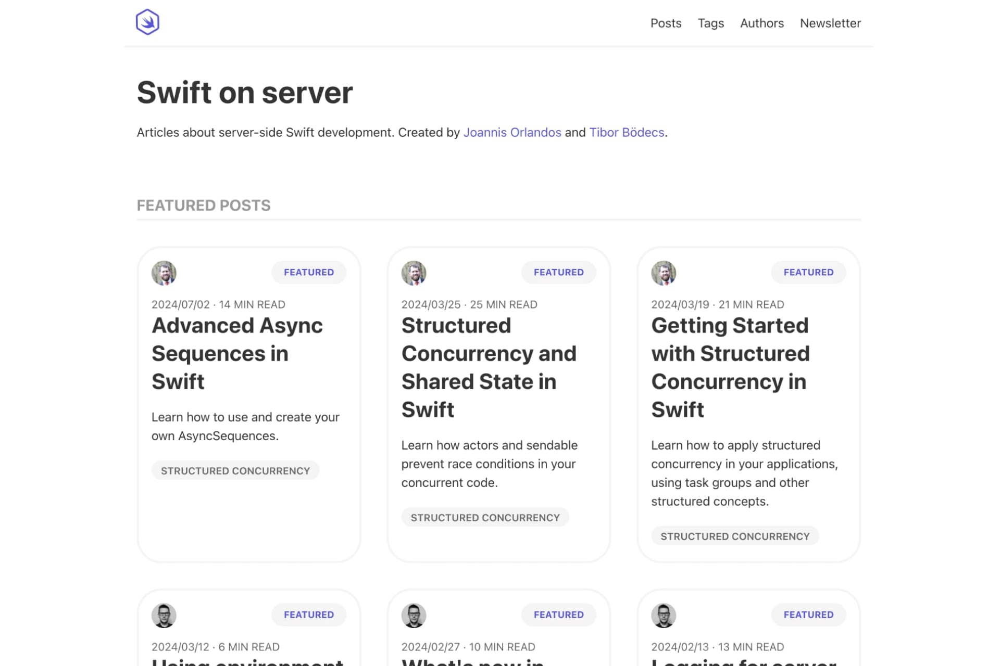
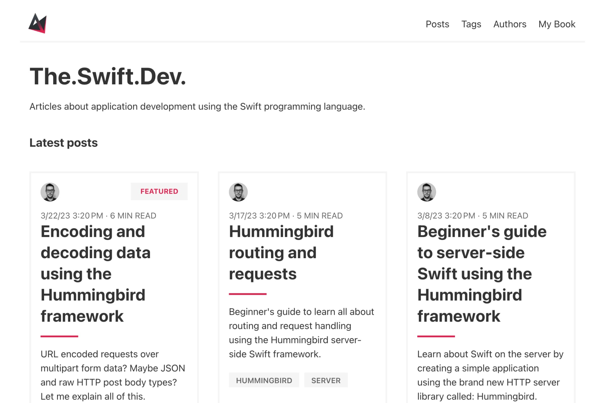

# Showcases

Toucan is used by the following websites. Feel free to [contact us](/contact/) if you’d like to feature your site.

@Grid {
    @Column {
        [
            
        ](https://developers.podcast.go-aws.com/web/index.html)
        [The AWS Developers Podcast](https://developers.podcast.go-aws.com/web/index.html)
    }
    @Column {
        [
            
        ](https://merkur17.net/)
        [Merkur17](https://merkur17.net/)
    }
    @Column {
        [
            
        ](https://binarybirds.com/)
        [Binary Birds](https://binarybirds.com/)
    }
    @Column {
        [
            
        ](https://swiftonserver.com/)
        [Swift on Server](https://swiftonserver.com/)
    }
    @Column {
        [
            
        ](https://theswiftdev.com/)
        [The.Swift.Dev](https://theswiftdev.com/)
    }
}
