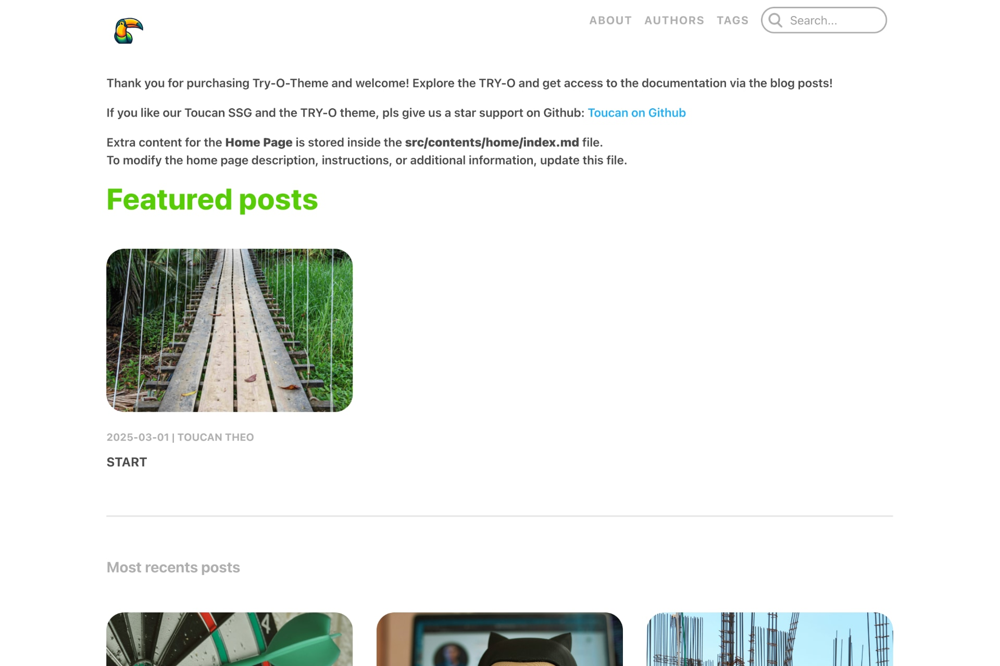

# Templates

Browse a variety of website templates designed for the Toucan Static Site Generator. Find the perfect template to build your site quickly and easily.

Take a look at our official starter templates below:

@Grid {
    @Column {
        [
            
        ](https://toucansites.github.io/t-doc-template-demo/)
    }
    @Column {
        <dl>
            

                <dt>Use cases</dt>
                <dd>Documentation, Knowledge base, wiki, course material, support portal, tutorial</dd>
            

            

                <dt>Features</dt>
                

                    <dd>2-level hierarchy (category, guide)</dd>
                    <dd>Navigation between guides</dd>
                    <dd>Guide outlines (Table of Contents)</dd>
                    <dd>Custom page support</dd>
                    <dd>Customization</dd>
                

            

            

                <dt>Creator</dt>
                <dd>Binary Birds</dd>
            

            

                <dt>License</dt>
                <dd>MIT</dd>
            

            

                <dt>&nbsp;</dt>
                <dd>
                    <a class="cta primary" href="https://toucansites.github.io/t-doc-template-demo/">Live demo</a><a class="cta secondary" href="https://github.com/toucansites/t-doc-template">GitHub</a>
                </dd>
            

        </dl>

        
    }
    
    @Column {
        [
            
        ](https://toucansites.github.io/try-o-template-demo/)
        
        
    }
    @Column {
        <dl>
            

                <dt>Use cases</dt>
                <dd>Blog, articles, stories, updates, insights.</dd>
            

            

                <dt>Features</dt>
                

                    <dd>Author, tag and article support with search</dd>
                    <dd>Navigation between articles</dd>
                    <dd>Share articles on social media</dd>
                    <dd>Custom page support</dd>
                    <dd>Customization</dd>
                

            

            

                <dt>Creator</dt>
                <dd>Binary Birds</dd>
            

            

                <dt>License</dt>
                <dd>MIT</dd>
            

            

                <dt>&nbsp;</dt>
                <dd>
                    <a class="cta primary" href="https://toucansites.github.io/try-o-template-demo/">Live demo</a><a class="cta secondary" href="https://github.com/toucansites/try-o-template">GitHub</a>
                </dd>
            

        </dl>

        
    }
    
}
