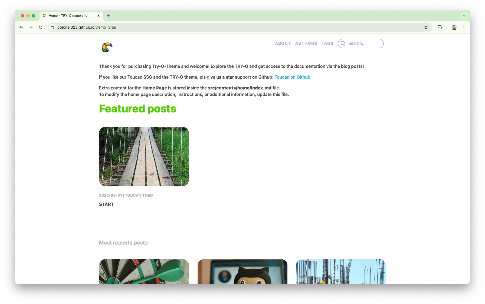

## Introducing TRY-O: The first and free blog template for Toucan

**Try it now**: Get your free template on [Gumroad](https://binarybirds.gumroad.com/l/TRY-O)

We are thrilled to announce the release of Try-O, the very first official template for the Toucan static site generator (ssg). Toucan is all Swift-based but the TRY-O template is designed for bloggers and content creators without Swift skills. Use plain Markdown to build your site & dig deeper into our mustache based template system for advanced customization. -> HTML & CSS only.

TRY-O is a free to use, minimalistic blog template designed for writers, bloggers, entrepreneurs, content creators, who want to focus on getting their message out there, without worrying about hosting fees and complex CMS.

TRY-O is currently working with **Toucan v1.0-beta3** and is available now for use, experimentation, and feedback.

## Why TRY-O?

Well, first of all it’s free, and it is named this way because we want you to try it! It is a very simple blog template with a couple of pages that you can edit in Markdown and then deploy for free via Github Pages. It is as lightweight as it can be! With clear instructions in the documentation, you can have your static site up and running in no time!

- ⚙️ **Easy to set up** – Run a command, edit a markdown file, incorporate your images and you’re live.
- 📦 **Fully static** – Which means it’s very fast, no backend / CMS required.
- 🌓 **Dark mode ready** – Serving your preference (either way).
- 🧱 **Tile-style layout** – Designed for both visual and text-heavy content.
- 📱 **Responsive by default** – Looks great on desktop and mobile.
- 🆓 **Free GitHub Pages hosting** – Yes, zero hosting fees!

## Write using Markdown

All written content is powered by Markdown, just create a post, add your image and Toucan will do the rest. It’s the developer-friendly way of blogging and it’s easier than you think.

## Deploy in minutes

Whether you’re using GitHub Pages or your own hosting, TRY-O is optimized for simple and fast deployment. Our default config supports GitHub Pages out of the box.

## What’s next

This is just the beginning. We’re already planning more Toucan templates, documentation improvements, and integrations to make site generation smoother than ever. Your feedback on TRY-O will help us shape that future.

## Join Us!

Join our Github community to request assistance, provide feedback, and help shape what Swift on the web should be.

- ⭐️ Star us on GitHub: [github.com/toucansites](https://github.com/toucansites)
- 🐥 Follow us on [https://x.com/tiborbodecs](https://x.com/tiborbodecs)
