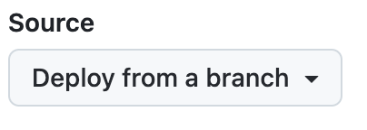
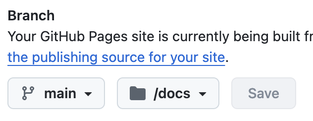

# GitHub Pages

Toucan-based websites can be hosted for free using GitHub Pages. Follow these steps to set up your site.

## Creating a repository for your site
---

You can either create a repository or choose an existing repository for your site.

If you want to create a GitHub Pages site for a repository where not all of the files in the repository are related to the site, you will be able to configure a publishing source for your site. For example, you can have a dedicated branch and folder to hold your site source files, or you can use a custom GitHub Actions workflow to build and deploy your site source files.

If the account that owns the repository uses GitHub Free or GitHub Free for organizations, the repository must be public.

If you want to create a site in an existing repository, skip to the [Creating your site](/docs/deployment/github-pages#creating-your-site) section.

1. In the upper-right corner of any page, select `+` , then click **New repository**.


2. Use the Owner dropdown menu to select the account you want to own the repository.


3. Type a name for your repository and an optional description. If you're creating a user or organization site, your repository must be named `<user>.github.io` or `<organization>.github.io`. If your user or organization name contains uppercase letters, you must lowercase the letters. For more information, see [About GitHub Pages](https://docs.github.com/en/pages/getting-started-with-github-pages/about-github-pages#types-of-github-pages-sites).


4. For the repository visibility, choose **public**. For more information, see [About repositories](https://docs.github.com/en/repositories/creating-and-managing-repositories/about-repositories#about-repository-visibility).

5. Select **Initialize this repository with a README**.

6. Click **Create repository**.


## Add content to the repository
---

1. Clone the Repository locally to your computer, if not already done:
    ```
    git clone https://github.com/your-username/your-repository.git
    ```

2. Navigate to the local repository folder and copy the `src` folder with all the content.
    Use the generator’s serve command:
    ```
    toucan generate
    ```
    After succesfull generation all the data is generated inside the `docs` folder by Toucan.

3. Push all the content to GitHub, add and commit files:
    ```
    git add .
    git commit -m "Add generated site content"
    git push origin main
    ```

## Creating your site
---

Before you can create your site, you must have a repository for your site on GitHub. If you're not creating your site in an existing repository, see [Creating a repository for your site](/docs/deployment/github-pages#creating-a-repository-for-your-site).

1. On GitHub, navigate to your site's repository.

2. Under your repository name, click `Settings`. If you cannot see the `Settings` tab, select the `...` dropdown menu, then click `Settings`.

3. In the `Code and automation` section of the sidebar, click `Pages`.

4. Under Source, leave the option `Deploy from a branch`.
    

5. Under Branch:
     
    - Select the branch where you committed your files (e.g., main).
	- Choose the **/docs** folder as the source.
	- Click Save.

6.	Check the published site, GitHub will provide a public URL for your site, such as:
	```
	https://your-username.github.io/my-github-page/
	```